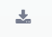
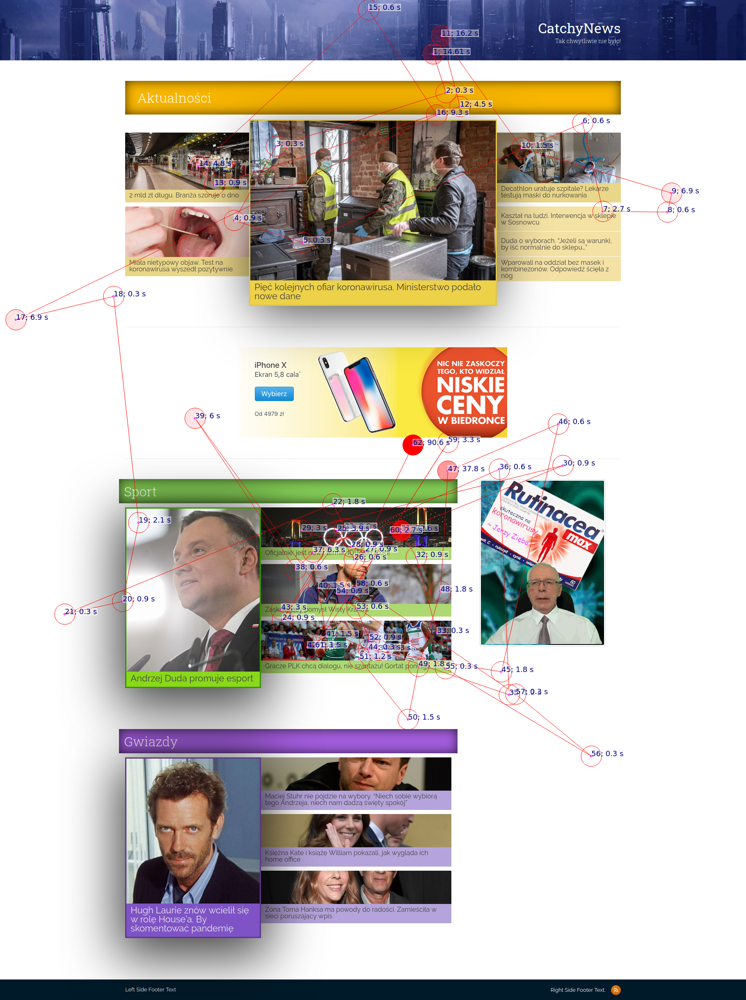

# inspectlet-mouse-movement-graph

Firefox add-on generating a mouse movement graph for particular segment of inspectlet.com session recording

## How to use

1. Clone the repository or download and unpack sources.
2. Open [`about:debugging#/runtime/this-firefox`](about:debugging#/runtime/this-firefox) in Firefox.
3. Load the add-on temporarily, by selecting `manifest.json` in the directory you put these sources.
4. Go to session player in Inspectlet (e.g. `https://www.inspectlet.com/dashboard/watchsession/...`), a new icon should be available on the right: .
5. A website screenshot with an overlaid graph should be opened in new tab (allow opening windows if such a yellow bar appears) – use right-click to save image.

_(Session player should be paused.)_

## Example result

Example mouse movement graph generated from a session on a site created with my team as a student project.

